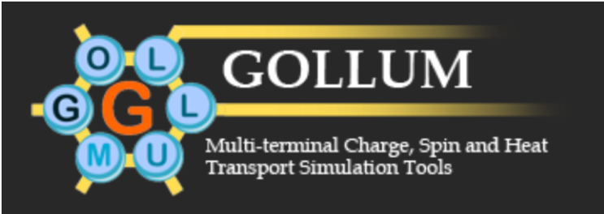

.. AiiDA Gollum Plugin documentation master file, created by
   sphinx-quickstart on Mon Jun 26 11:33:57 2017.
   You can adapt this file completely to your liking, but it should at least
   contain the root `toctree` directive.

#######################################
`AiiDA`_ plugin for `GOLLUM`_
#######################################

.. _AiiDA: http://www.aiida.net
.. _GOLLUM: http://www.physics.lancs.ac.uk/gollum

Welcome to the AiiDA-Gollum documentation!
++++++++++++++++++++++++++++++++++++++++++++

..

The aiida-gollum python package interfaces the GOLLUM transport code
(http://www.physics.lancs.ac.uk/gollum) with the AiiDA framework
(http://www.aiida.net). The package contains plugins for GOLLUM
itself and basic workflows. It is distributed under the MIT license
and available from (https://github.com/garsua/aiida-gollum/).

Acknowledgments:
----------------

The Gollum input plugin, parser, workflow and examples were developed
by Victor M. Garcia-Suarez.

We acknowledge support from the Spanish MINECO (project
FIS2015-63918-R), the Spanish Ministerio de Ciencia, Innovación y Universidades
(project PGC2018-094783-B-I00) and the EU Centre of Excellence “MaX –
Materials Design at the Exascale” (http://www.max-centre.eu).
(Horizon 2020 EINFRA-5, Grant No. 676598). We also thank the AiiDA
team for their help.

Contents:
---------

Installation
============

.. toctree::
   :maxdepth: 2

   installation

GOLLUM plugins
=================

.. toctree::
   :maxdepth: 2

   plugins/gollum

GOLLUM Workflows
======================

.. toctree::
   :maxdepth: 4

   workflows/gollum-siesta
..
   

Indices and tables
==================

* :ref:`genindex`
* :ref:`modindex`
* :ref:`search`

